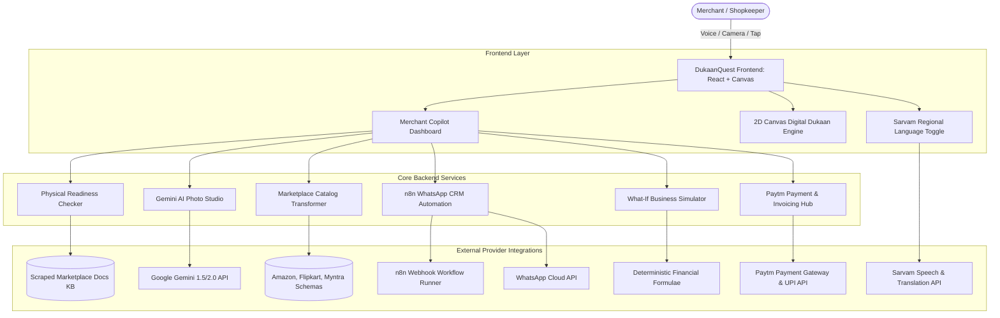

# 📦 DukaanQuest — Project Vision & Architecture Specification

> **Hackathon:** Hack Sprint 2026 (SDG MIT Bengaluru)  
> **Track:** FinTech & Commerce (PS-21)  
> **Problem Statement:** Empowering traditional offline retail merchants to transition into high-growth digital commerce through intuitive, low-barrier, and culturally localized technology.  
> **Target Delivery Date:** October 4, 2026 (Submission Deadline: October 5, 2026, 11:50 PM IST)

---

## 1. Executive Summary & Purpose

**DukaanQuest** is an AI-powered, gamified omnichannel growth copilot built for India’s 60M+ street-side and market shopkeepers (Kiranas, cloth merchants, shoe retailers, hardware stores). 

Unlike existing merchant applications (like Shopify, Khatabook, or Amazon Seller Central) that either cater only to accounting or overwhelm non-technical shop owners with intimidating dashboards, **DukaanQuest bridges the gap between physical retail reality and digital e-commerce**:
1. **Physical First**: Scrapes official marketplace compliance standards (Amazon, Flipkart, Myntra) to tell the shopkeeper what physical tasks they must do (packaging, polybag thickness, barcode stickers, GST billing) *before* attempting digital listings.
2. **AI Product Studio**: Turns raw smartphone photos taken inside cramped shops into 4K white-background, e-commerce grade catalog images using **Google Gemini**.
3. **Omnichannel Listing Generation**: Converts a single voice or text product record into platform-compliant formats for Amazon, Flipkart, and Myntra simultaneously.
4. **Automated WhatsApp CRM**: Re-engages offline walk-in customers through automated WhatsApp workflows driven by **n8n** and localized with **Sarvam AI**.
5. **Deterministic "What-If" Business Simulator**: Allows shopkeepers to model revenue growth, margin impact, and platform commission costs before risking capital.
6. **Gamified Quest Engine**: Turns intimidating business modernization into a step-by-step RPG with an interactive 2D isometric Canvas town ("Digital Dukaan") where completing real business milestones upgrades physical buildings in real time.

---

## 2. Target User Persona

### Primary Persona: "Ramesh-ji" (The Traditional Retailer)
* **Age & Profile:** 52 years old, owner of *Shree Ganesh Matching & Saree Centre* in Gandhi Bazaar.
* **Operating Reality:** Operates in a 180 sq.ft physical shop, working 10–12 hours a day. Has 1 helper.
* **Tech Comfort:** Uses WhatsApp daily for family and vendor chats. Receives customer payments on Paytm QR Soundbox. Uses smartphone, but finds English dashboards, Excel sheets, and complex web forms confusing.
* **Core Anxieties:**
  - *"Online platforms will reject my sarees or charge penalty fees if I package them wrong."*
  - *"Professional photographers charge ₹300 per product shoot; I can't afford that for 150 items."*
  - *"Regular customers buy once, walk away, and forget to return when fresh festival stock arrives."*
  - *"I don't speak or write professional English for e-commerce listings."*

---

## 3. Product Tenets & Design Principles

1. **Human-in-the-Loop Simplicity:** AI suggests, but the merchant confirms with one tap. Never trigger external actions (like blasting WhatsApp messages or launching ads) without clear merchant authorization.
2. **Deterministic Calculations, Not LLM Numbers:** All financial simulations, margins, and commission percentages use mathematically audited formulas. LLMs explain insights, but never fabricate revenue projections.
3. **Physical-to-Digital Integrity:** Never let a merchant list a product online until they pass the physical readiness checklist for that channel.
4. **Vernacular by Design:** All UI text, voice prompts, and generated marketing copy are native-ready in English, Hindi, Kannada, and Tamil via **Sarvam AI**.
5. **Gamification with Utility:** Game mechanics (XP, Badges, Level Progression) are tied 1:1 to real-world business literacy, not superficial distractions.

---

## 4. Sponsor Integration Architecture

| Sponsor | Core Role in DukaanQuest | Technical Integration Point |
| :--- | :--- | :--- |
| **Google Gemini** | Multimodal Vision & Copy Generation | Product photo studio (background removal, lighting cleanup), SEO bullet generator, ad copy generator. |
| **n8n** | Automation Workflow Backbone | WhatsApp CRM engine, webhook triggers for QR onboarding, abandoned cart / inactive customer reminder workflows. |
| **Sarvam AI** | Regional Language & Voice Infrastructure | Indic speech-to-text, voice-guided product onboarding, vernacular WhatsApp templates in Hindi, Kannada, and Tamil. |
| **Paytm** | Digital Payment & Financial Intelligence | Paytm Payment Links API generation, dynamic UPI QR codes for walk-in customer capture, transaction settlement analytics. |

---

## 5. High-Level System Architecture

---

## 6. Project Directory Conventions

To enable multi-agent parallel construction, code is partitioned cleanly:
* `/src/components/game`: Canvas-based interactive Digital Dukaan, buildings, sprite rendering, and XP animations.
* `/src/components/readiness`: Physical Readiness Checklist components, platform tabs (Amazon/Flipkart/Myntra), status indicators.
* `/src/components/studio`: Gemini AI Photo Studio upload, before/after comparison sliders, export buttons.
* `/src/components/crm`: n8n WhatsApp workflow visualizer, audience segment builder, campaign dispatcher.
* `/src/components/simulator`: What-If business scenario sliders, chart visualizer, revenue projections.
* `/src/services`: API adapters for Gemini, Sarvam, n8n, and Paytm mock/live bridges.
* `/src/data`: Scraped compliance rules, sample inventory, quest definitions.

---

## 7. Success Criteria for Hackathon Qualification
* ✅ High-fidelity, polished, responsive UI with rich aesthetics (dark mode, glassmorphism, responsive animations).
* ✅ Real working demos for all 6 engines with zero placeholder dead-ends.
* ✅ Visual demonstration of n8n workflow JSON, Sarvam voice toggle, Gemini photo conversion, and Paytm payment links.
* ✅ Official 7-slide HackSprint presentation generated with production screenshots.
