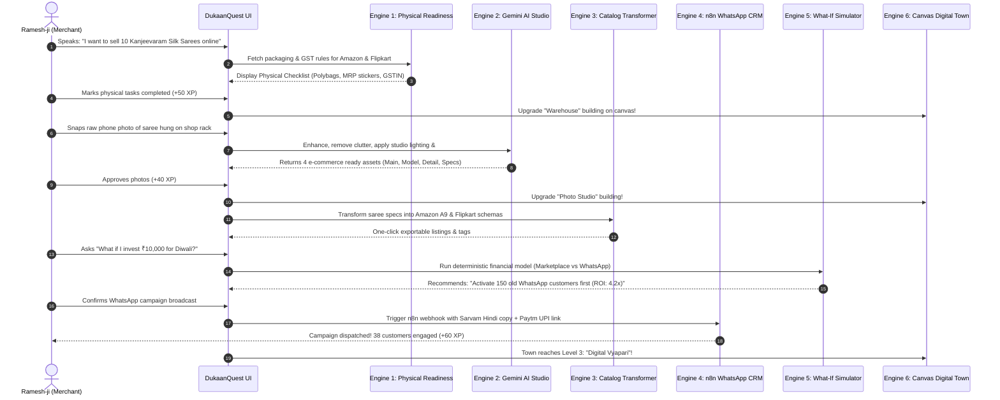

# 📋 Product Requirements Document (PRD): DukaanQuest
### An AI-Powered, Gamified Omnichannel Growth Copilot for Small Indian Retailers

---

## 📌 Document Metadata
* **Project Name:** DukaanQuest (दुकानक्वेस्ट)
* **Hackathon:** Hack Sprint 2026 (SDG MIT Bengaluru)
* **Track:** FinTech & Commerce (PS-21)
* **Document Version:** 1.0.0
* **Target Delivery Date:** October 4, 2026
* **Screening Submission Deadline:** October 5, 2026, 11:50 PM IST
* **Target Audience:** Engineering Agents, Frontend/Backend Developers, UI/UX Designers, Judges

---

## 1. Executive Summary & Problem Framing

### 1.1 The Core Reality
India is home to over **60 million small street-side and market retailers** (textile shops, general stores, footwear sellers, electronics retailers). While large digital marketplaces (Amazon, Flipkart, Myntra) account for billions in GMV, less than **8% of physical independent merchants** successfully sell online. 

When a traditional merchant attempts to modernize, they encounter a crippling wall of friction:
1. **The Physical Knowledge Blindspot:** Existing platforms expect sellers to already know how to package goods according to marketplace standards (e.g., 50+ micron polybags with suffocation warnings, FNSKU barcode stickers, drop-tested carton sealing). Sellers get penalized or rejected before their first sale.
2. **The Photography Barrier:** E-commerce requires high-resolution, pure-white background (#FFFFFF) catalog photos with proper lighting. Professional studio photography costs ₹250–₹500 per item—untenable for a merchant with 200 SKUs.
3. **The Multilingual Literacy Gap:** Seller portals are dense, technical, and predominantly in English. Most shopkeepers conduct business in regional vernaculars (Hindi, Kannada, Tamil, Telugu).
4. **The Customer Retention Leak:** Offline walk-in customers make a cash/UPI purchase and leave without ever being added to a digital CRM or notified of seasonal sales.
5. **The Capital Uncertainty Trap:** Merchants have no way to test whether spending ₹5,000 on Facebook ads or listing on Amazon will yield profits or lead to inventory loss and high return fees.

### 1.2 The Solution: DukaanQuest
**DukaanQuest** is an **omnichannel business copilot** wrapped in a **gamified RPG quest structure**. It acts as an entire e-commerce, CRM, and marketing department for a solo shopkeeper. 

```
┌────────────────────────────────────────────────────────────────────────┐
│                        DUKAANQUEST COPILOT                             │
├──────────────────┬──────────────────┬──────────────────────────────────┤
│ 1. Physical Prep │ 2. Gemini Studio │ 3. Omnichannel Catalog           │
│ Scrapes Amazon,  │ Turns raw phone  │ Generates listings for Amazon,   │
│ Flipkart & Myntra│ photos into 4K   │ Flipkart, and Myntra from one    │
│ seller specs.    │ white-bg shots.  │ voice/text record.               │
├──────────────────┼──────────────────┼──────────────────────────────────┤
│ 4. n8n WhatsApp  │ 5. What-If Sim   │ 6. 2D Canvas Digital Dukaan      │
│ Automated CRM &  │ Deterministic    │ Interactive town view that grows │
│ customer retention│ financial engine │ as real business milestones      │
│ in native tongues│ models ROI first.│ are unlocked.                    │
└──────────────────┴──────────────────┴──────────────────────────────────┘
```

---

## 2. Target Persona & User Journey

### 2.1 Primary Persona: "Ramesh-ji" (Cloth & Saree Retailer)
* **Shop:** *Shree Ganesh Matching & Saree Centre*, Avenue Road / Gandhi Bazaar.
* **Daily Workflow:** 10:00 AM to 9:30 PM. Serves walk-in customers, arranges fabric rolls, takes UPI payments on a soundbox.
* **Tech Comfort:** Smartphone user, heavy WhatsApp user, does not use laptop/desktop.
* **Language:** Comfortable in Hindi and Kannada; reads basic English.
* **Direct Quote:** *"I want to sell my Kanjeevaram sarees on Amazon and notify my regular customers on WhatsApp when new Diwali stock comes, but I don't have an IT team or studio."*

### 2.2 End-to-End User Journey


---

## 3. Product Principles & Non-Negotiables

1. **"Human-in-the-Loop" Authorization:** AI generates proposals; the merchant retains ultimate authority via clear confirmation modals. No WhatsApp messages, ad budgets, or listings are pushed autonomously without explicit approval.
2. **Deterministic Financial Math:** Financial models, commissions, shipping deductions, and profit estimates are computed strictly through audited formulas, never LLM hallucinations. The LLM only interprets the calculated output into natural language.
3. **No Dead-Ends or Placeholders:** Every button, tab, and card must render responsive, interactive state. Even simulated backend calls must return realistic, high-fidelity mock payloads.
4. **Honesty & Credibility:** We present our system as an **integration-ready, workflow-unifying copilot**, not as a false claim of having internal Amazon Seller API partnerships.

---

## 4. Detailed Feature Specifications (The 6 Engines)

### 4.1 Engine 1: Physical Readiness Checker
* **Objective:** Ensure the merchant fulfills real-world physical and legal requirements before listing digitally.
* **Supported Platforms:** Amazon India, Flipkart Seller Hub, Myntra Partner.
* **Category Focus:** Apparel, Sarees, Footwear, Consumer Goods.
* **Core Requirements:**
  - **Platform Rule Ingestion:** Scraped guidelines covering:
    - **Packaging:** Minimum 50-micron transparent polybags; mandatory bilingual child suffocation warnings; tamper-evident adhesive tape.
    - **Labeling:** Barcode/FNSKU stickers (minimum 2x1 inches), outer carton MRP stickers, wash-care tags.
    - **Regulatory:** Valid GSTIN matching bank account name, HSN code verification (e.g., HSN 5208 for cotton fabrics).
    - **Logistics:** Designated courier pickup area, weighing scale accuracy (<20g tolerance).
  - **UI/UX Interactions:**
    - Platform selector tabs with brand logos (Amazon, Flipkart, Myntra).
    - Interactive completion toggles with visual progress bar (e.g., `5/8 Completed - 62%`).
    - "Print Specs & Labels" helper modal.
    - XP reward upon reaching 100% readiness with an unlocked "Platform Certified" badge.

### 4.2 Engine 2: Gemini AI Product Studio
* **Objective:** Convert raw, cluttered smartphone photos into professional e-commerce studio shots.
* **Powered by:** Google Gemini 1.5/2.0 Multimodal Vision APIs.
* **Core Requirements:**
  - **Asset Ingestion:** File upload dropzone supporting `.jpg`, `.png`, `.webp`, plus pre-loaded merchant inventory samples:
    1. *Royal Kanjeevaram Silk Saree* (Raw shop hanger photo).
    2. *Handloom Cotton Kurta* (Folded shelf photo).
    3. *Casual Denim Shirt* (Countertop photo).
  - **Image Processing Pipelines:**
    - **Main Shot (Amazon Compliance):** Background removed, replaced with pure white `#FFFFFF`, centered, product occupying >85% of frame, subtle drop shadow.
    - **Lifestyle Context Shot (Myntra Compliance):** Saree/garment synthetically mapped to an elegant Indian mannequin in warm ambient studio lighting.
    - **Fabric Detail Macro Shot:** High-clarity zoomed texture highlighting zari border and thread count.
    - **Infographic Dimension Shot:** Dimensions (Length: 5.5m + 0.8m Blouse Piece), pure silk certification logo, and care instruction icons.
  - **UI/UX Interactions:**
    - Interactive before/after split slider.
    - Download bundle button (`ZIP` containing all 4 normalized assets).

### 4.3 Engine 3: Omnichannel Catalog Transformer
* **Objective:** Single-entry master catalog transformed into platform-specific listing structures.
* **Core Requirements:**
  - **Unified Master Record Fields:**
    - Product Title, Category, Base Price (₹), Discounted Price (₹), SKU, Material/Fabric, Color, Sizes, Stock Quantity, Description.
  - **Platform Output Adapters:**
    - **Amazon India:** Character-limited title optimized for A9 search, 5 bullet points structured as `[Feature]: [Benefit]`, backend search terms, standard apparel category feed.
    - **Flipkart:** Style code, fabric care instructions, occasion tag, pack of 1, return policy disclaimer.
    - **Myntra:** Brand approval format, styling recommendations, fabric composition ratio, trend keywords.
  - **UI/UX Interactions:**
    - Tabbed platform preview cards showing exactly how the listing looks on each marketplace.
    - "Copy JSON Payload" and "Download CSV Flat-File" buttons.

### 4.4 Engine 4: n8n WhatsApp CRM & Automation Hub
* **Objective:** Re-engage past physical customers using automated, localized WhatsApp workflows.
* **Powered by:** n8n Workflow Automation Engine + Sarvam AI + WhatsApp Business Cloud API.
* **Core Requirements:**
  - **Customer Database Model:**
    - Name, Phone, Total Spend, Last Visit Date, Tags (`VIP`, `Diwali Buyer`, `Inactive >30d`, `Bridal`).
  - **Interactive n8n Visual Workflow:**
    - Visual node graph rendering: `Webhook Trigger` → `Filter: Inactive >30d` → `Sarvam Translate (Hindi)` → `Paytm Payment Link Generator` → `WhatsApp Cloud API Dispatch`.
    - Nodes pulsate when executing a simulated campaign.
  - **Campaign Templates:**
    - *Template A (Diwali Festive Launch):* "Namaste Ramesh-ji's valued customer! Our new festive silk collection has arrived with exclusive 15% VIP discount."
    - *Template B (30-Day Win-Back):* "We miss seeing you at Shree Ganesh Matching Centre! Here is a ₹200 gift voucher for your next visit."
  - **Paytm Payment Link Embed:** Each message includes an instant Paytm UPI payment link for remote reservation.
  - **Safety Gate:** One-tap merchant approval modal before sending.

### 4.5 Engine 5: Deterministic "What-If" Business Simulator
* **Objective:** Give merchants risk-free decision intelligence before spending money.
* **Calculation Engine (Deterministic Math):**
  - **Parameters:**
    - Monthly Offline Revenue ($R_{off}$), Available Investment Budget ($B$), Target Growth ($G$).
  - **Strategy A (Marketplace Expansion):**
    - Gross Sales Projection = $B \times 3.2$
    - Marketplace Commission = $18\%$
    - Shipping & Logistics Cost = ₹95 per unit
    - Return Rate Risk = $18\%$ (with ₹60 reverse logistics penalty)
    - Net Margin = $\sim 14.5\%$ | Payback = 28 days.
  - **Strategy B (WhatsApp Customer Reactivation):**
    - Audience Reach = Existing customer database ($N$)
    - Conversion Rate = $22\%$
    - Acquisition Cost = ₹0.80 per WhatsApp message (n8n API cost)
    - Net Margin = $\sim 42\%$ | Payback = 2 days.
  - **Strategy C (Hyperlocal Meta Ads):**
    - Ad Spend = $B$ | Target Radius = 5km
    - Estimated Reach = $1,000 \text{ views per } ₹120$
    - Footfall Conversion = $3.5\%$
    - Net Margin = $\sim 28\%$ | Payback = 6 days.
  - **AI Synthesizer:** Produces a plain-vernacular summary ranking the strategies from safest to most aggressive.

### 4.6 Engine 6: Gamified Digital Dukaan & Quest Engine
* **Objective:** Replace technical onboarding manuals with an addictive, rewarding digital literacy game.
* **Core Requirements:**
  - **2D Canvas Town ("Digital Dukaan"):**
    - Rendered on HTML5 `<canvas>` with animated idle states.
    - Central Building: *Physical Shop* (Starts modest, gains lights and banners as XP grows).
    - Surroundings:
      - *The Packaging Warehouse* (Unlocked via Engine 1).
      - *The AI Photo Studio* (Unlocked via Engine 2).
      - *The E-Commerce Gateway* (Unlocked via Engine 3).
      - *The WhatsApp Communication Tower* (Unlocked via Engine 4).
      - *The Simulation Observatory* (Unlocked via Engine 5).
  - **XP & Level Mechanics:**
    - Level 1: *Galli Retailer* (0–200 XP)
    - Level 2: *Mohalla Merchant* (200–500 XP)
    - Level 3: *Digital Vyapari* (500–900 XP)
    - Level 4: *City Champion* (900–1400 XP)
    - Level 5: *Digital Mahajan* (1400+ XP)
  - **Daily & Progressive Quests:**
    - "Inspect 3 products for Amazon packaging" (+30 XP)
    - "Clean background for 1 saree photo" (+40 XP)
    - "Send WhatsApp greeting to 25 VIP buyers" (+50 XP)

---

## 5. Sponsor Integration Specifications

### 5.1 Google Gemini
* **Endpoints Utilized:** Gemini 1.5 Pro / Flash Multimodal.
* **Role:**
  - Vision processing for raw product photo analysis and white background normalization.
  - Generative text for SEO-optimized marketplace titles, bullet points, and marketing messages.
* **Demo Mock Engine:** Integrated mock response handler returning structured vision transformations with 800ms natural delay for judge evaluation.

### 5.2 n8n Workflow Automation
* **Role:** Enterprise-grade orchestration engine connecting merchant database, Sarvam AI translation, Paytm payment links, and WhatsApp Cloud APIs.
* **Deliverable:** Live interactive visual flow diagram in the UI and downloadable `dukaanquest-n8n-workflow.json`.

### 5.3 Sarvam AI
* **Role:** Indic language voice and text infrastructure.
* **Supported Languages:** English, Hindi (हिंदी), Kannada (ಕನ್ನಡ), Tamil (தமிழ்).
* **Capabilities:**
  - Full-app UI text translation dictionary.
  - Voice-guided assistant prompt playback.
  - Vernacular WhatsApp message generation.

### 5.4 Paytm
* **Role:** Payment processing and financial checkout.
* **Capabilities:**
  - Dynamic UPI QR code generator for shop counter scans.
  - Automated Paytm Payment Links created via API for inclusion in WhatsApp marketing broadcasts.
  - Transaction settlement analytics dashboard.

---

## 6. Technical Stack & Data Models

### 6.1 Technology Stack
* **Frontend Framework:** React 18 / Vite with Vanilla CSS Modules & Design Tokens.
* **Canvas Engine:** Native HTML5 2D Canvas Context API with custom sprite rendering.
* **Icons:** Lucide React / Tabler SVG icons.
* **State Management:** React Context API + LocalStorage persistence.
* **Testing:** Vitest / Component testing.
* **Deployment:** Vercel / Railway ready.

### 6.2 TypeScript Data Schemas

```typescript
// 1. Product Master Schema
export interface MasterProduct {
  id: string;
  title: string;
  category: 'saree' | 'kurta' | 'shirt' | 'fabrics';
  basePrice: number;
  discountPrice?: number;
  sku: string;
  material: string;
  colors: string[];
  sizes: string[];
  stockCount: number;
  rawImage: string;
  processedImages: {
    amazonMain: string;
    myntraLifestyle: string;
    fabricDetail: string;
    dimensions: string;
  };
  readinessStatus: {
    amazon: boolean;
    flipkart: boolean;
    myntra: boolean;
  };
}

// 2. Physical Readiness Item
export interface ReadinessCheckItem {
  id: string;
  platform: 'amazon' | 'flipkart' | 'myntra';
  category: string;
  title: string;
  description: string;
  mandatory: boolean;
  specDetails: string;
  completed: boolean;
  xpReward: number;
}

// 3. Customer & CRM Schema
export interface Customer {
  id: string;
  name: string;
  phone: string;
  language: 'hi' | 'kn' | 'ta' | 'en';
  tags: ('VIP' | 'Inactive' | 'Festive' | 'Regular')[];
  totalSpend: number;
  lastPurchaseDate: string;
}

// 4. n8n Campaign Schema
export interface WhatsAppCampaign {
  id: string;
  title: string;
  targetTag: string;
  language: 'hi' | 'kn' | 'ta' | 'en';
  templateBody: string;
  paytmPaymentLink: string;
  status: 'draft' | 'pending_approval' | 'dispatched';
  recipientsCount: number;
}

// 5. What-If Simulation Schema
export interface SimulationScenario {
  strategyName: string;
  projectedRevenue: number;
  estimatedCost: number;
  netMarginPercentage: number;
  paybackDays: number;
  riskRating: 'Low' | 'Medium' | 'High';
  recommendationReason: string;
}

// 6. Quest & Gamification Schema
export interface Quest {
  id: string;
  category: 'physical' | 'photo' | 'catalog' | 'crm' | 'finance';
  title: string;
  description: string;
  xp: number;
  completed: boolean;
  unlocksBuilding?: 'warehouse' | 'studio' | 'marketplace' | 'tower' | 'observatory';
}
```

---

## 7. UI/UX Design System Specification

### 7.1 Visual Philosophy
* **Theme:** Sleek, high-contrast dark mode with glassmorphic cards and vibrant micro-gradients.
* **Color Palette:**
  - **Background Base:** `#0B0F19` (Deep Obsidian Void)
  - **Card Surface:** `rgba(18, 24, 38, 0.75)` with `backdrop-filter: blur(16px)` and `border: 1px solid rgba(255, 255, 255, 0.08)`
  - **Primary Brand (Violet):** `#7C3AED` to `#6366F1` (DukaanQuest Royal Glow)
  - **Success / Ready (Emerald):** `#10B981` (Marketplace Certified)
  - **Warning / Action (Amber):** `#F59E0B` (Physical Check Needed)
  - **Paytm Accent (Cyan):** `#00BAF2`
  - **Text Primary:** `#F8FAFC`
  - **Text Secondary:** `#94A3B8`
* **Typography:** `Outfit` for headings and brand metrics, `Inter` for data tables and readable body text.

---

## 8. Presentation Deliverables (PPT & Pitch Alignment)

The project maps 1:1 to the 7-slide official template in `HackSprint PPT Presentation.pptx`:
* **Slide 1:** Title, Track (FinTech & Commerce PS-21), Team Member Names.
* **Slide 2:** Problem Statement (Ramesh-ji's real cloth shop story) + DukaanQuest 6-Engine Solution.
* **Slide 3:** Tech Stack & Architecture Diagram (All 4 sponsors: Gemini, n8n, Sarvam, Paytm).
* **Slide 4:** Gamification Engine (2D Canvas Digital Dukaan & Quest Literacy Curriculum).
* **Slide 5:** End-to-End Data Flow Diagram (Merchant Input → Processing Engines → Output).
* **Slide 6:** 4K Screenshots of the live, running web application.
* **Slide 7:** Market Opportunity (60M+ retailers, $1.3T commerce), Real Merchant Interview Quote, Future Roadmap.

---

## 9. Verification & Acceptance Criteria (UAT)

| Test ID | Module | Verification Step | Expected Outcome |
| :--- | :--- | :--- | :--- |
| **UAT-01** | Physical Readiness | Toggle Amazon polybag checklist item | Progress bar advances, completion percentage recalculates, XP pops up. |
| **UAT-02** | Gemini Studio | Click "Enhance Photo" on Kanjeevaram Saree | Before/after slider shows studio-lit pure white background asset and detail shots. |
| **UAT-03** | Catalog Transformer | Switch between Amazon, Flipkart, Myntra tabs | Content dynamically shifts to respect character limits and schema rules of each portal. |
| **UAT-04** | n8n WhatsApp CRM | Trigger VIP Diwali Campaign | n8n visual flow animates; translated Hindi preview with Paytm link appears for approval. |
| **UAT-05** | What-If Simulator | Adjust investment slider from ₹5,000 to ₹25,000 | Deterministic math recalculates margins, risk, and returns across 3 strategies instantly. |
| **UAT-06** | Digital Dukaan Canvas | Complete 2 quests | Canvas updates building sprite levels in real time with 60 FPS animation. |
| **UAT-07** | Sarvam Localization | Toggle language selector to "हिंदी" or "ಕನ್ನಡ" | UI text and labels seamlessly switch to selected Indic language. |

---

## 10. Multi-Agent Development Playbook

Any agent picking up tasks in this repository should follow these assignments:
* **Agent 1 (Frontend Lead):** Initialize React/Vite app in `dukaanquest-app`, build design system, layout navigation, and Canvas town engine.
* **Agent 2 (Commerce & Readiness Specialist):** Build Engine 1 (Physical Checklist) & Engine 3 (Catalog Transformer) with verified platform rules.
* **Agent 3 (AI & Multimodal Specialist):** Build Engine 2 (Gemini Photo Studio) with realistic before/after comparisons and sample asset data.
* **Agent 4 (Automation & FinTech Specialist):** Build Engine 4 (n8n WhatsApp Flow), Engine 5 (What-If Simulator), and Paytm integration.
