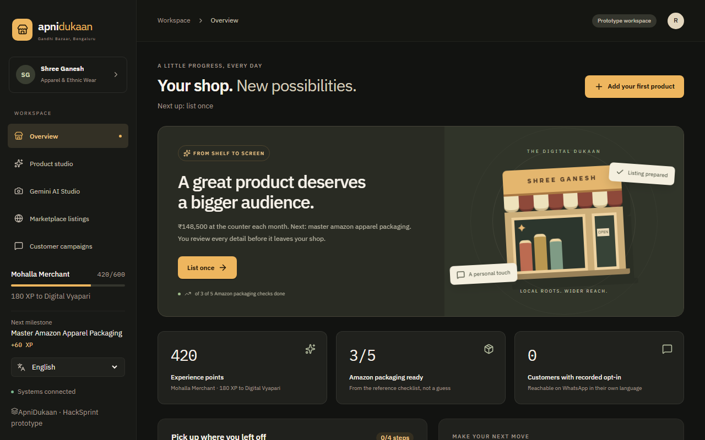
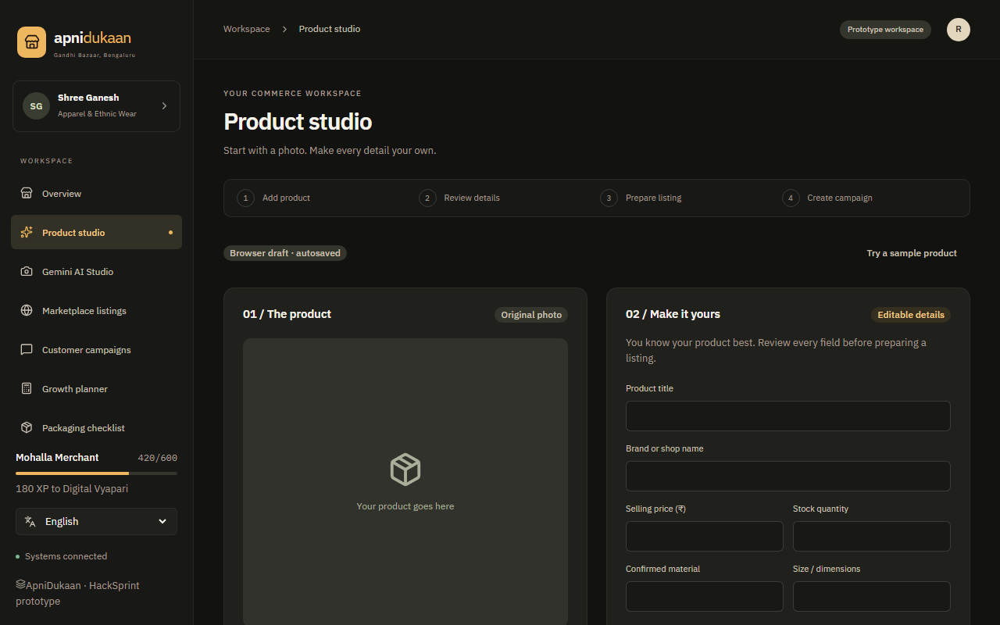
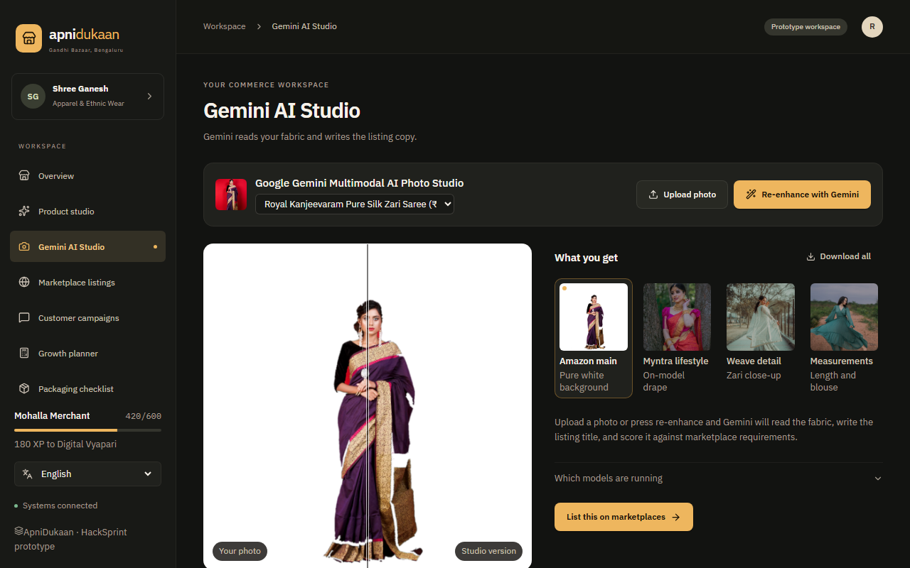
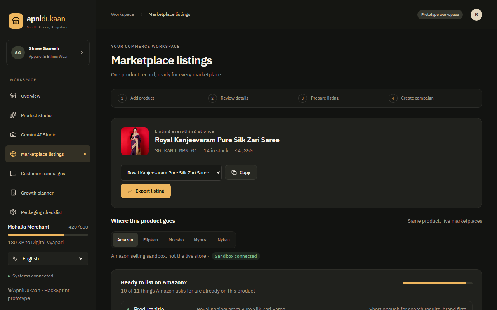
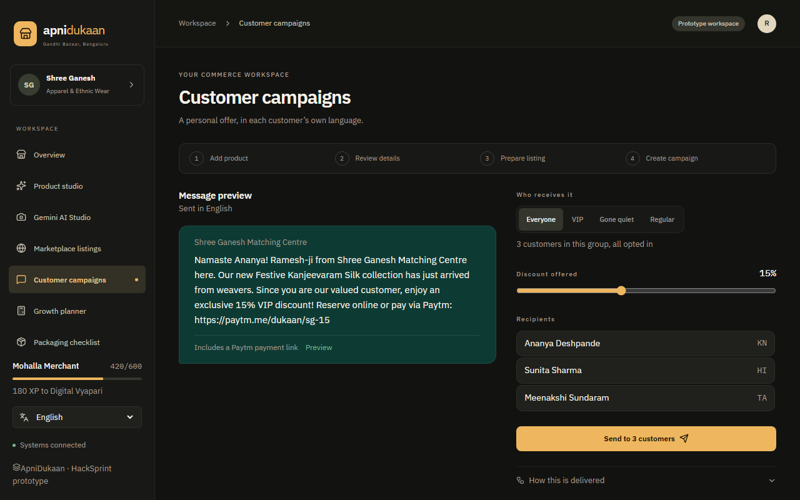
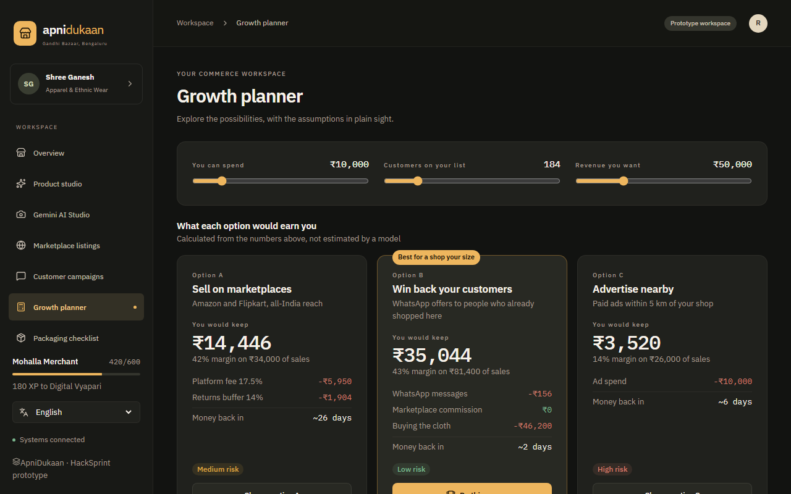
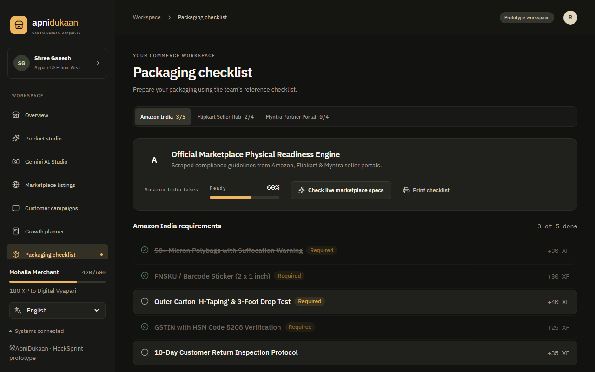
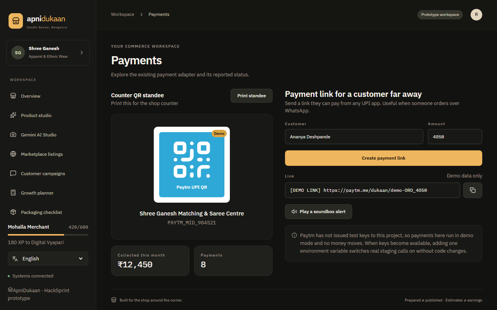

<p align="center">
  
</p>

<h1 align="center">ApniDukaan</h1>
<p align="center">
  <strong>A gamified omnichannel growth copilot for traditional Indian retailers.</strong><br>
  Get stock marketplace-ready &middot; reach walk-ins on WhatsApp &middot; know what pays before spending &mdash;<br>
  in the language the shop actually speaks.
</p>

<p align="center">
  
  
  
  
  
</p>

---

## Why this exists

An independent saree or kurta shop loses customers in three specific places, and
none of them are a software bug:

| The real job | What actually goes wrong today |
| --- | --- |
| **Get listed on marketplaces** | Packaging, labelling and compliance are guesswork; listings die in review. |
| **Reach walk-in customers again** | The WhatsApp list sits unused because writing a message in four languages is work. |
| **Spend money wisely** | A small ad or a WhatsApp offer is a gamble, so it usually is not tried. |

ApniDukaan turns those into a five-step journey a merchant can finish in an
afternoon, and shows the assumptions behind every number it produces.

---

## Screens

<div align="center">

| | | |
|:--:|:--:|:--:|
| <br>**Product studio**<br>One draft becomes a listing | <br>**Gemini AI Studio**<br>Studio photos from a phone snap | <br>**Marketplace listings**<br>Amazon, Flipkart, Meesho, Myntra, Nykaa |
| <br>**Customer campaigns**<br>WhatsApp offers in four languages | <br>**Growth planner**<br>Compare the options before spending | <br>**Packaging checklist**<br>Compliance, item by item |
| <br>**Payments**<br>Counter QR and payment links | <br>**Honest integrations**<br>Every service reports its real state | <br>**Your shop, growing**<br>XP, quests and milestones |

</div>

---

## What is in the box

| Area | Screen | What the merchant does |
| --- | --- | --- |
| Physical prep | **Packaging checklist** | Check Amazon / Flipkart / Myntra packaging, labelling and compliance boxes, earn XP, print the checklist. |
| Photo studio | **Gemini AI Studio** | Upload a phone photo of a saree or kurta, get a studio version, a listing title and a compliance read. |
| Product studio | **Product studio** | One draft flows through add &rarr; review &rarr; listing &rarr; campaign without retyping. |
| Catalog | **Marketplace listings** | See the Amazon SP-API payload and how the same product fits Flipkart, Meesho and Nykaa. |
| CRM | **Customer campaigns** | Segment registered customers, translate the message, approve once, dispatch to WhatsApp. |
| Planning | **Growth planner** | Set budget, customers and target revenue; compare the options with cited assumptions. |
| Payments | **Payments** | Generate a Paytm payment link or counter QR standee. |
| Growth | **Your shop** | Isometric shop plot with XP, quests and milestones across five journey steps. |

**Five journey steps** &mdash; `Photograph` &rarr; `List once` &rarr; `Reach customers` &rarr; `Simulate` &rarr; `Grow`.
A step only counts as done when its quest is genuinely finished or its checklist
is at 100 %. Opening a screen is never progress.

**Four languages** &mdash; English, हिंदी, ಕನ್ನಡ, தமிழ் &mdash; with an on-device
translation cache, so the interface and the customer message speak the shop's
language.

---

## Quick start

```bash
# 1. Backend dependencies
cd server && npm install && cd ..

# 2. Backend configuration (secrets stay local, the template is committed)
cp server/.env.example server/.env

# 3. Start the API on http://localhost:5000
npm run server

# 4. Frontend dependencies and dev server
npm --prefix dukaanquest-app install
npm run client          # http://localhost:5173
```

The frontend needs no `.env` locally: it calls the relative path `/api` and the
Vite dev proxy forwards that to `http://localhost:5000`, so the browser stays
same-origin and no CORS round trip is involved.

Every integration degrades to an honest `STAGED` or `FALLBACK` state when its
key is missing, so the app is fully explorable with an empty `.env`.

### Scripts

| Command | Purpose |
| --- | --- |
| `npm run server` | Start the Express API on port 5000. |
| `npm run client` | Start the Vite dev server on port 5173. |
| `npm run build` | Production build of the frontend into `dukaanquest-app/dist/`. |
| `npm run preview` | Serve the production build locally. |
| `npm --prefix dukaanquest-app run lint` | `oxlint` over the frontend source. |
| `node dukaanquest-app/tests/draft.test.mjs` | Frontend unit tests. |

---

## Configuration

Secrets are never committed. Both packages ship a template and read a
git-ignored real file.

### `server/.env`

Copy from `server/.env.example`. Every key is optional. Groups: Google Gemini,
Sarvam AI (translation), WhatsApp Cloud API via n8n, n8n (`N8N_WEBHOOK_URL`,
`N8N_API_KEY`, `N8N_BASE_URL`), Paytm, Amazon SP-API, Flipkart, plus the
deployment section (`PORT`, `FRONTEND_URL`).

### `dukaanquest-app/.env`

Only needed when the frontend is deployed separately from the API:

```bash
VITE_API_BASE_URL=https://your-api-host.example
```

Bare origin, no trailing slash, no `/api` suffix &mdash; the client appends `/api`.

> `VITE_*` values are **inlined into the client bundle at build time and are
> public**. Never put a token, key or secret in one.

---

## Architecture

```
.
├── dukaanquest-app/            # Frontend — React 19 + Vite
│   └── src/
│       ├── App.jsx             # shell, tab state, journey logic, health sync
│       ├── index.css           # design tokens and UI component classes
│       ├── services/
│       │   ├── api.js          # env-aware client (apiUrl, isCrossOriginApi)
│       │   └── draft.js        # product-draft schema helpers
│       ├── i18n/TranslationProvider.jsx   # tx(), DO_NOT_TRANSLATE, cache
│       ├── utils/
│       │   ├── imageBudget.js  # keeps uploads under the 4.5 MB body cap
│       │   └── whiteBackground.js
│       ├── data/               # mockData.js (offline fallback), workspace.js
│       └── components/         # layout, game, readiness, studio, catalog,
│                               # crm, simulator, paytm, ProductWorkspace
│
├── server/                     # Backend — Node + Express
│   ├── index.js                # /api routes, CORS allowlist, error handler
│   ├── .env.example            # committed template, never the real .env
│   ├── .vercelignore           # keeps .env out of any Vercel upload
│   ├── db/                     # JSON store: loadDB / saveDB / persistence
│   └── services/               # n8n, whatsapp status, gemini, sarvam,
│                               # amazon, marketplace adapters, paytm, scraper
│
├── docs/screenshots/           # captures used in this README
├── VERCEL_DEPLOYMENT.md        # full public-deployment runbook
└── README.md
```

**Stack** &mdash; React 19, Vite 8, plain DOM + Canvas 2D (no UI framework, no
router), `oxlint`; Express 4, `axios`, `cheerio`, `cors`, `dotenv`, `multer`,
and a JSON file store. Fonts: IBM Plex Sans + Mono, Noto Sans for Devanagari,
Kannada and Tamil. Icons: Lucide React.

### API contract the frontend depends on

- `GET /api/health` returns `overall` (`"ok"` | `"partial"`) &mdash; **not**
  `status` &mdash; plus `integrationSummary`, `services`, `persistence`, `app`,
  `version`, `timestamp`.
- `health.services.<key>.classification` (`LIVE` / `SANDBOX` / `STAGED` /
  `FALLBACK`) drives every integration badge. No state is hardcoded in the UI.
- Write endpoints return `persisted` plus `persistence`, so the client never
  claims a save that the filesystem refused.
- `/api/quests` entries carry no `building` key; `QUEST_BUILDING` in
  `src/data/workspace.js` keeps the shop plot truthful.

---

## Built to stay honest

Most of the integrations here are sandboxed, staged or deliberately offline.
This project treats that as something to report, not something to hide &mdash;
and the README will never claim more than the code can prove.

- **Integration states come from the API, never from constants.** Before
  `/api/health` answers, the panel shows a staged fallback; afterwards every
  label is derived from the live payload.
- **A WhatsApp `wamid` means Meta accepted the request, not that it was
  delivered.** The backend reports `metaAccepted` and `deliveryStatus`
  separately and never claims `LIVE_DELIVERY_CONFIRMED` from a `wamid`. Real
  confirmation needs the Meta status webhook on a public backend URL.
- **Error codes are surfaced, not swallowed.** Meta failures are classified and
  returned with the actual reason &mdash; `131030` recipient not on the verified
  allow list, `131049` engagement filter on marketing templates.
- **Unconfigured means unconfigured.** With no n8n URL on Vercel, dispatch
  reports `N8N_NOT_CONFIGURED` and sends nothing, instead of falling back to a
  localhost that cannot exist in production.
- **Read-only filesystems degrade loudly.** On Vercel the JSON store cannot
  persist: `saveDB()` returns `false`, `/api/health` reports `READ_ONLY_SEED`,
  and the response states that the write was not persisted.
- **Marketplace and payment actions are labelled.** Sandbox submissions say so,
  and demo Paytm links are marked `[DEMO LINK]`.

---

## Deployment

Frontend and backend ship as **two separate Vercel projects**. The full
procedure &mdash; project settings, environment variables, the CORS table, the
n8n blocker, known limitations and post-deploy test commands &mdash; is in
**[VERCEL_DEPLOYMENT.md](./VERCEL_DEPLOYMENT.md)**.

1. **Backend** &mdash; Root Directory `server`, preset Node.js.
   `server/index.js` exports the app and calls `app.listen` only when run
   directly, so Vercel's zero-config detection works.
2. **Frontend** &mdash; Root Directory `dukaanquest-app`, with
   `VITE_API_BASE_URL` set to the backend's production origin.
3. Set `FRONTEND_URL` on the backend to the frontend's origin &mdash; CORS uses
   an explicit allowlist and never a wildcard.
4. Put env vars in the Vercel dashboard, never in the repo.

Note that ignore files resolve **relative to the configured Root Directory**,
so the root `.gitignore` is not consulted once Root Directory is set. That is
why `server/.vercelignore` exists.

---

## Roadmap

### Near term &mdash; make the staged paths real

- **Persist real data.** Replace the JSON file store with a hosted database
  (Postgres/Neon) so XP, quests, checklists and the delivery log survive a
  redeploy. The store already exposes `persistence` state, so the schema swap is
  isolated.
- **Real WhatsApp delivery.** Needs three things at once: an approved
  **utility** template (the marketing template is blocked by the engagement
  filter), a publicly reachable n8n instance, and the Meta status webhook
  subscribed on the WABA. The per-`wamid` delivery log is already built &mdash;
  it just needs the webhook feeding it.
- **Marketplace OAuth.** Flipkart, Meesho and Nykaa adapters are shaped and
  staged; production seller credentials would turn them live alongside the
  existing Amazon sandbox path.
- **Live Paytm keys.** Test-key generation is currently unavailable on the
  Paytm dashboard, so payments run staged with demo links; real keys need no
  architecture change.

### Medium term &mdash; make it stickier

- **Offline-first PWA** with a service worker, so a shop with patchy internet
  still completes a checklist and queues a campaign.
- **Inventory and billing** &mdash; stock levels, reorder alerts, and GST-ready
  invoices generated from a listing instead of retyped.
- **Campaign analytics** &mdash; open, click and re-order rates per cohort, fed
  back into the growth planner so the next suggestion is based on what this shop
  actually sold.
- **Voice input** in four languages, so a merchant can dictate an offer instead
  of typing it.
- **Team accounts** with roles for owner, staff and packer, and an audit trail
  of who approved which send.

### Longer term

- **WhatsApp Business API native features** &mdash; catalogue messages, quick
  replies and automated responses inside the 24-hour customer service window.
- **Regional expansion** beyond the current four languages, chosen by where the
  merchants actually are.
- **A marketplace aggregator** so one product record stays canonical while each
  channel keeps its own pricing and inventory.
- **Credit and cashflow modelling** &mdash; whether a marketplace payout cycle is
  survivable for this shop before the product is offered.

---

## Notes for contributors

- Do not add a router, new CSS components or new fonts. The design system in
  `dukaanquest-app/src/index.css` is the single source of visual style.
- `App.jsx` state matters: `go(id)` drives both the sidebar and the Golden
  Journey, and `stepDone()` is the single source of truth for what "done" means.
- Keep uploads under the platform limit. `src/utils/imageBudget.js` compresses
  and re-encodes images because serverless functions reject request bodies over
  4.5 MB and that cap is not configurable.
- If you touch the integration panel, re-read the `/api/health` contract above.
  The `overall` field and the per-service classification are the only two facts
  the UI is allowed to derive from.
- `server/.env` holds real credentials and is git-ignored. Rotate any token that
  reaches a log or a terminal.
- `.claude/`, `.agents/`, `.planning/` and similar local AI tooling is
  git-ignored and is not part of the application.

---

<p align="center">
  <sub>ApniDukaan &middot; HackSprint prototype &middot; built for the shops that built the high street</sub>
</p>